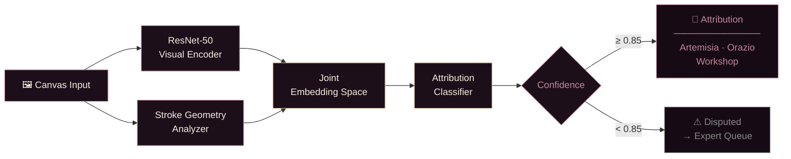

 

 

---

**MSc Computer Science (AI)** &nbsp;·&nbsp; Georgia Institute of Technology  
**MA Art History** &nbsp;·&nbsp; Ben-Gurion University  
**MA Celtic Studies** &nbsp;·&nbsp; University of Wales Trinity Saint David  
**BA Economics** &nbsp;·&nbsp; Ben-Gurion University  
**BSc Computer Science** &nbsp;·&nbsp; University of London  

---

 

I study how machines see.  
I study how humans have always seen — through paint, through story, through markets.  
The through-line, it turns out, is pattern recognition.

 

Currently: building a dual-model ML framework to answer an art attribution question that has been contested since the 1970s. Training on brushstroke geometry, compositional habits, and pigment distribution across the Gentileschi workshop. Also: path/policy search algorithms, PID drone controllers, particle filters — the usual.

When I'm not at a desk: horseback, armor, or both.

 

---

### ✦ Stack

 

---

### ✦ Gentileschi Attribution Pipeline

*Dual-model ML framework. Settles a 50-year art history debate computationally.*

 

---

### ✦ Now

<!--START_SECTION:activity-->
<!--END_SECTION:activity-->

 

---

### ✦ Contribution Map

  <picture>
    <source media="(prefers-color-scheme: dark)" srcset="https://raw.githubusercontent.com/ladyFaye1998/ladyFaye1998/output/github-contribution-grid-snake-dark.svg" />
    <source media="(prefers-color-scheme: light)" srcset="https://raw.githubusercontent.com/ladyFaye1998/ladyFaye1998/output/github-contribution-grid-snake.svg" />
    
  </picture>

 

---

&nbsp;
&nbsp;

  

 

