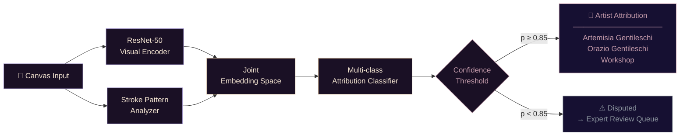

 

 

---

I train models on 17th-century oil paint. I build pixel-art games about satirical Arthurian knights. I draft novels set across multiple timelines. Somewhere in between, I found that machine intelligence and humanistic inquiry ask the same questions — just in different dialects.

Currently: finishing an MSc in Computer Science (AI track) at Georgia Tech, while running a dual-model ML framework to settle an art history debate that has been ongoing since the 1970s.

 

---

### ✦ What's running

| | |
|---|---|
| **ML × Art History** | Dual-model framework for Gentileschi workshop attribution — quantifying brushstroke *habits* across Artemisia and Orazio &nbsp;·&nbsp; MA Art History, Ben-Gurion University |
| **AI Systems** | Path/policy search algorithms, PID drone controllers, particle filters &nbsp;·&nbsp; MSc CS, Georgia Tech |
| **Automated Search** | Fine-tuned T5 model generating Boolean search strategies from job descriptions + semantic resume scoring &nbsp;·&nbsp; BSc CS, University of London |
| **Sir Dinadan's Quest** | 2D pixel-art game following the most underrated knight in Arthurian legend — built in Unity/C#, auto-deployed via GitHub Actions |
| **The Novel** | A time-travel narrative. Edinburgh aesthetic. Destined-legend structure. In progress. |

 

---

### 🧠 Gentileschi Attribution Pipeline

*A dual-model ML framework for art history — because the 1970s debate deserved a computational answer.*

 

---

### ✦ Automated Search Strategy — T5 Pipeline

*Fine-tuned T5 generating Boolean queries from natural language job descriptions, with semantic resume scoring.*

 

---

### ✦ Built with

 

---

### ✦ Contribution Map

  <picture>
    <source media="(prefers-color-scheme: dark)" srcset="https://raw.githubusercontent.com/ladyFaye1998/ladyFaye1998/output/github-contribution-grid-snake-dark.svg" />
    <source media="(prefers-color-scheme: light)" srcset="https://raw.githubusercontent.com/ladyFaye1998/ladyFaye1998/output/github-contribution-grid-snake.svg" />
    
  </picture>

 

---

### ✦ Recent

<!--START_SECTION:activity-->
<!--END_SECTION:activity-->

 

---

### ✦ Find me

&nbsp;&nbsp;
&nbsp;&nbsp;

 

---

*If you want to see where this goes — the novel, the research, the pixel-art knights — you can support it here.*

 

 

